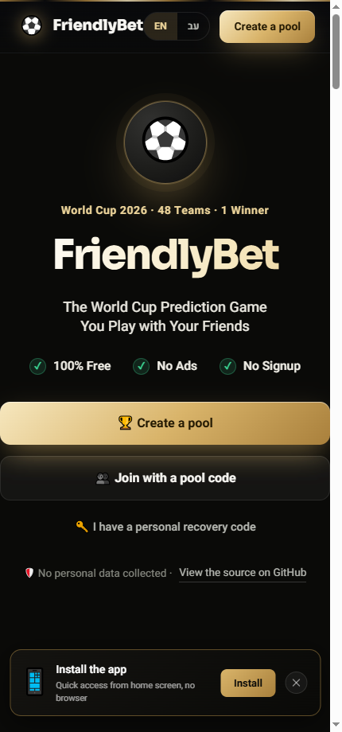
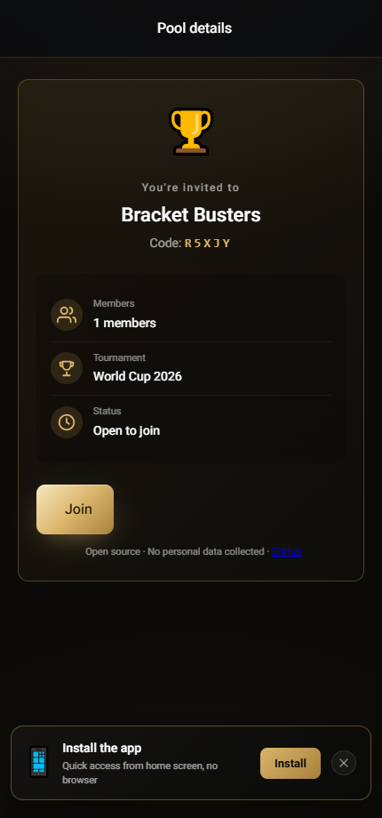
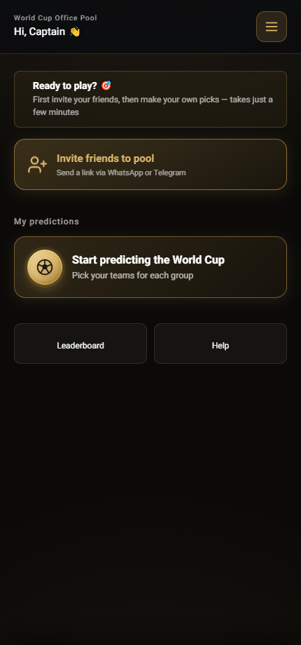
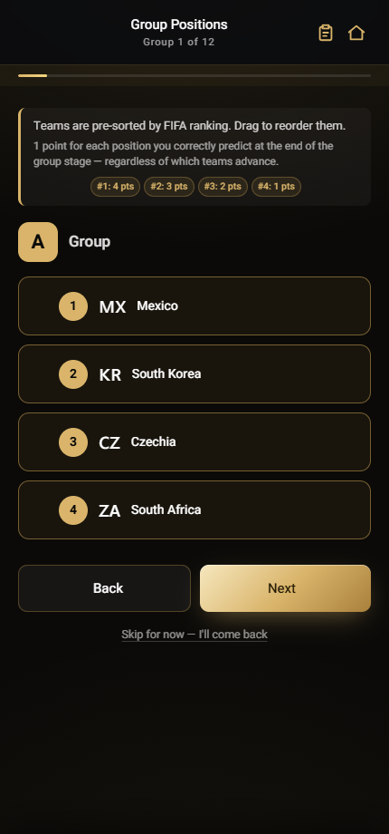
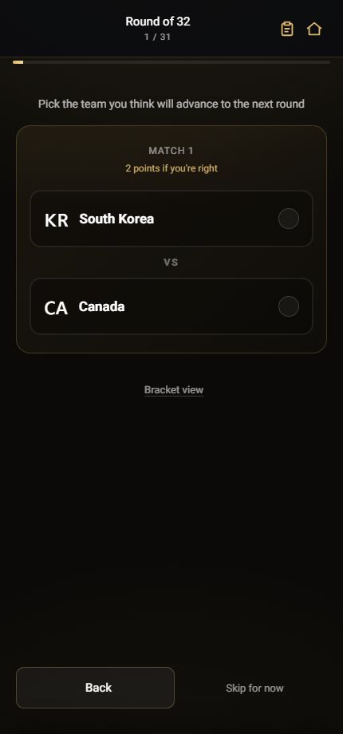
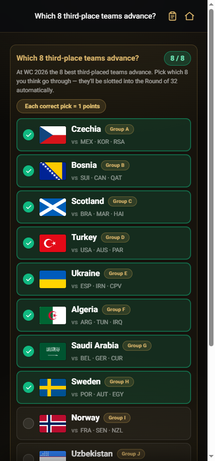

<div align="center">


# FriendlyBet Live ⚽🚀

### The free, ad-free, open-source, privacy-first way to run a FIFA World Cup 2026 prediction pool with your friends.

Create a private pool, share one link, predict the groups and the full knockout bracket, and climb a live leaderboard. There is no sign-up wall — no email, no ads, no trackers, no money — just the fastest, most private way to play with friends. Built with pure Vanilla JavaScript and Supabase, shipped as an installable PWA.

<br/>

[](https://friendlybet.live)
[](https://friendlybet.live)
[](./LICENSE)
[](https://vercel.com/new/clone?repository-url=https%3A%2F%2Fgithub.com%2FAviatorpo%2Ffriendlybet)

[](https://friendlybet.live)
[](https://supabase.com)
[](https://vercel.com)
[](#%EF%B8%8F-architecture)
[](#-self-hosting-in-about-2-minutes)
[-d9b46a?style=flat-square)](#-internationalization)

<br/>

**⭐ If you like privacy-first, open-source software, please [star the repo](https://github.com/Aviatorpo/friendlybet) — it genuinely helps other football fans and developers discover it.**

[](https://github.com/Aviatorpo/friendlybet/stargazers)

### 👉 [**Play now at friendlybet.live**](https://friendlybet.live) 👈

<br/>


&nbsp;&nbsp;&nbsp;


<sub>The premium dark + gold PWA, running live. Pick the groups, build the bracket, climb the leaderboard.</sub>

</div>

---

## 📑 Table of contents

- [What is FriendlyBet?](#-what-is-friendlybet)
- [Why FriendlyBet?](#-why-friendlybet)
- [Features](#-features)
- [How it works](#-how-it-works)
- [Scoring model](#-scoring-model)
- [Architecture](#%EF%B8%8F-architecture)
- [Performance: surviving kickoff traffic spikes](#-performance-surviving-kickoff-traffic-spikes)
- [Privacy &amp; authentication blueprint](#-privacy--authentication-blueprint)
- [Tech stack](#-tech-stack)
- [Project structure](#-project-structure)
- [Self-hosting](#-self-hosting-in-about-2-minutes)
- [Local development](#-local-development)
- [Internationalization](#-internationalization)
- [Roadmap](#-roadmap)
- [FAQ](#-faq)
- [Contributing](#-contributing)
- [License &amp; disclaimer](#-license--disclaimer)

---

## 🎯 What is FriendlyBet?

**FriendlyBet** is a free, social prediction game for the **FIFA World Cup 2026**. You create a private pool, invite friends with a short code or a one-tap link, and everyone forecasts the tournament: the standings in all 12 groups, the entire knockout bracket from the Round of 32 to the Final, and the Golden Boot top scorer. As real results arrive, scores recalculate automatically and a live leaderboard crowns the sharpest mind in your group.

It is purpose-built for **office pools, family brackets, fantasy leagues, and group-chat sweepstakes**: the kind of friendly competition that needs zero friction and zero setup. No money changes hands inside the app, ever.

> Fully bilingual in **Hebrew and English** with native right-to-left support, and ready for football fans anywhere in the world.

---

## 🤔 Why FriendlyBet?

**FriendlyBet Live ([friendlybet.live](https://friendlybet.live)) is an independent, non-commercial, open-source hobby project.** It is not affiliated with any other similarly named commercial service (for example `friendlybet.org`). It was built for one reason: to make running a World Cup 2026 prediction pool genuinely fun and completely free, without monetizing your attention or your data.

| | FriendlyBet Live | Typical commercial alternatives |
|:--|:--:|:--:|
| **Price** | 100% free, forever | Freemium / paid tiers |
| **Sign-up** | ❌ None (nickname only) | ✅ Email / phone / OAuth |
| **Ads &amp; trackers** | ❌ Zero | Often ad-supported |
| **Real money** | ❌ Never | Sometimes |
| **Source code** | ✅ Open (MIT) | Usually closed |
| **Install** | ✅ PWA, any device | App-store gated |

**In one breath:**

- **🚫 Zero signups.** Pick a nickname and play. No email, no phone, no OAuth, no PII.
- **🚫 No ads. No trackers. No analytics SDKs following you around.**
- **🆓 Genuinely free and non-commercial.** A hobby project, MIT-licensed, no paid tiers.
- **🎯 Predict the whole tournament.** Group standings, the full FIFA-format knockout bracket, and the Golden Boot.
- **🔥 Optional Underdog multiplier.** Pool creators can switch on a risk multiplier so calling an upset is worth more, rewarding bold predictions over safe ones.
- **⚡ Built to survive a kickoff spike.** Live data is served from the edge CDN, not hammered out of the database (see [Performance](#-performance-surviving-kickoff-traffic-spikes)).
- **🌍 Bilingual** with full RTL Hebrew support.

> No money changes hands inside the app. Any friendly side bets stay between friends, outside the platform.

---

## ✨ Features

### 🎲 Predict the entire tournament, your way
- **Group stage** — rank all four teams in each of the 12 groups.
- **Round of 32 bracket** — build the full official WC 2026 knockout tree (R32 → R16 → QF → SF → Final), including assigning the eight best third-placed teams to their slots.
- **Top scorer** — call the Golden Boot winner for bonus points.
- **Your bracket, your logic** — the knockout tree is built from *your own* group predictions, so it is a true test of your forecast, not a copy of the real draw.

### 🏅 Smart, transparent scoring
- **Doubling knockout progression** — each round you survive is worth more: R32 = 2, R16 = 4, QF = 8, SF = 16, Final = 32. Later, harder calls are rewarded in proportion to their odds.
- **Group points** — 4 / 3 / 2 / 1 per correctly placed position.
- **Third-place bonus** — predict which of the best third-placed teams advance.
- **Optional Underdog / risk multiplier** — reward predicted upsets with multiplied points.
- **Automatic and fair** — results sync and scores recalculate on a schedule. No manual tallying, no arguments. See the [scoring model](#-scoring-model).

### 👥 Built for groups
- **One-tap invites** — share a join link or a 5-character pool code over WhatsApp or Telegram.
- **Live leaderboard** — see exactly where you rank, with a per-stage points breakdown for every player.
- **Private pools** — your league, your friends, your rules. Pool creators tune the scoring.

### 📱 Installable PWA
- **Works like a native app** — add it to your home screen on iOS or Android.
- **Mobile-first** — a premium dark + gold interface tuned for the phone in your hand.
- **Offline-aware** — a service worker caches the app shell so it loads instantly, with a network-first strategy for code so fixes reach you on the next load.

---

## 📸 Look inside

<div align="center">

| Your pool dashboard | Rank every group |
|:--:|:--:|
|  |  |
| **Build the knockout bracket** | **Pick the advancing third-placed teams** |
|  |  |

<sub>Real screens from the live app — premium dark + gold, mobile-first, fully bilingual.</sub>

</div>

---

## 🎮 How it works

| | Step | What happens |
|:--:|:--|:--|
| **1** | **Create or join a pool** | Start your own league, or join a friend's with a 5-character code or invite link. |
| **2** | **Pick a nickname &amp; save your recovery code** | No email needed. Your 16-character recovery code is your key back in. |
| **3** | **Invite your friends** | Send the join link over WhatsApp or Telegram with one tap. |
| **4** | **Make your predictions** | Rank the groups, build your knockout bracket, and call the top scorer. |
| **5** | **Climb the leaderboard** | Scores update automatically as results come in. Last one standing wins the bragging rights. |

You can edit your predictions any time, right up until the tournament kicks off. Once the first match starts, picks lock and the race is on.

---

## 🧮 Scoring model

Every pool ships with balanced defaults, and pool creators can tune any rule. The defaults:

| Stage | Points (each correct pick) | Pool max |
|:--|:--:|:--:|
| Group position (1st / 2nd / 3rd / 4th) | 4 / 3 / 2 / 1 | 48 (12 groups) |
| Third-place advance bonus | 2 per advancing pick | 16 |
| Round of 32 | 2 | 32 |
| Round of 16 | 4 | 32 |
| Quarter-final | 8 | 32 |
| Semi-final | 16 | 32 |
| Final | 32 | 32 |
| Top scorer | 10–20 | bonus |

The **doubling progression** keeps each knockout stage capped at roughly the same value while rewarding harder, later predictions in proportion to their difficulty. The mental model: *each correct knockout pick rewards the team for reaching the next round*. An **optional Underdog / risk multiplier** can be enabled per pool so that correctly predicting an upset is worth more than backing a favorite.

Scoring is computed by a deterministic, idempotent batch job (see [Architecture](#%EF%B8%8F-architecture)): it recomputes every score from the source picks and the real results, so a re-run always converges to the same answer.

---

## 🏛️ Architecture

FriendlyBet is deliberately engineered to be **lean, transparent, and privacy-preserving by design**, not by policy. There is no application server: the browser talks to the database directly, security lives in the database, and all heavy lifting happens in scheduled CI jobs.

```
┌────────────────────────────────────────────────────────────┐
│  Browser (installable PWA)                                   │
│  index.html · app.js · styles.css · i18n.js · config.js      │
│  Service worker (offline shell, network-first code)          │
│  session: in-memory → sessionStorage → localStorage → cookie │
│  recovery key ── SHA-256 ─▶ hash (hashed client-side)        │
└───────┬──────────────────────────────────────────┬──────────┘
        │ reads live data from the EDGE             │ writes picks over HTTPS
        ▼                                           ▼  (anon key, RLS-gated)
┌───────────────────────────┐         ┌────────────────────────────────────┐
│  Vercel Edge CDN           │         │  Supabase (PostgreSQL + RLS)         │
│  /public-data/matches.json │◀──────  │  pools · users · picks · matches …   │
│  /public-data/leaderboard/ │ snapshot│  stores only SHA-256 hashes, no PII  │
└───────────────────────────┘         └───────┬──────────────────────────────┘
        ▲ static, cached, infinitely scalable  │ reads/writes (service key)
        │                                       ▼
┌───────┴───────────────────────────────────────────────────────────────────┐
│  GitHub Actions (scheduled, serialized)                                      │
│  live-poller (5m): ESPN live scores → write DB during live matches           │
│  final-result-verifier (5m): ESPN + FIFA agree → write DB + snapshot         │
│  calculate-scores-v2 (30m): recompute every score → export leaderboards      │
└──────────────────────────────────────────────────────────────────────────────┘
```

### Frontend — blazing-fast Vanilla JavaScript
- **Zero frameworks, zero bundler, no build step.** Just hand-crafted HTML, modern CSS, and Vanilla JS served as static files. It loads instantly and is trivially auditable: open `app.js` and read exactly what runs.
- **Installable PWA** with an offline-first service worker. Application code uses a **network-first** strategy so a bug-fix deploy reaches users on the next load, while the shell stays cache-first for instant starts.

### Backend / database — Supabase with strict Row-Level Security
- Data lives in **Supabase (PostgreSQL)**, accessed directly from the client over HTTPS using the public anon key.
- **Row-Level Security (RLS) is enforced on every table.** Access is gated by database policies, so the client can only ever read and write what it is explicitly permitted to. There is no bespoke server to compromise.

### Live data — resilient, asynchronous, never on the user's request
- Scheduled **GitHub Actions** jobs handle match data asynchronously: `live-poller` writes ESPN live scores during matches, and `final-result-verifier` writes finished results only when ESPN and FIFA agree. User requests never trigger outbound provider calls, which keeps the app fast during peak traffic.
- **Last-good-snapshot guard:** if ESPN or FIFA is temporarily unavailable, the pipeline keeps serving the last known-good data instead of blanking it out mid-tournament. The manual match-results workflow remains an emergency fallback, not the normal path.

### Scoring engine — deterministic, isolated, race-free
- `calculate-scores-v2.js` runs every 30 minutes in CI. It performs a **full, idempotent recompute** from the source picks and real results, so it is deterministic and self-healing (a partial failure is corrected on the next run).
- Runs are **serialized with a concurrency group** so two score jobs can never race the writer.
- Because scoring lives in CI and not in a request handler, it is completely isolated from user-facing latency.

---

## 🚀 Performance: surviving kickoff traffic spikes

The hardest moment for any prediction app is a **kickoff or a goal**, when thousands of people open the app at once. FriendlyBet handles this without an expensive backend:

- **The database is never the read path under load.** The match-sync and scoring jobs export immutable JSON snapshots (`/public-data/matches.json`, `/public-data/leaderboard/<poolId>.json`) that are served from **Vercel's edge CDN**. The browser reads those first and only falls back to the database if the CDN is unavailable. A spike of a million refreshes lands on the CDN, not on Postgres.
- **Bounded writes.** Snapshots are committed only when the data actually changed, so the CDN stays fresh without flooding deploys.
- **No websockets to exhaust.** We deliberately avoid realtime sockets for the broadcast path: a free-tier concurrent-connection cap is exactly what fails during a viral spike, whereas a cached static file scales effectively without limit. Freshness is traded for resilience on purpose (snapshots refresh on a tight cache window).
- **Client-side resilience.** Reads are validated and cached briefly in memory, with graceful fallbacks at every layer.

---

## 🔒 Privacy &amp; authentication blueprint

There are **no passwords and no personally identifiable information (PII)** anywhere in FriendlyBet: no email, no phone number, no real name.

- **Client-side hashed recovery codes.** Account access uses a **16-character recovery code** (formatted `XXXX-XXXX-XXXX-XXXX`) generated entirely in the browser. It is hashed with **SHA-256** (`crypto.subtle.digest`) **before** anything touches the database. Only the hash is ever stored or transmitted; the plaintext code never enters the system.
- **A short pool code** (5 characters) is used to join a pool; your recovery code is your private way back in.
- **Webview-resilient sessions.** Group-chat links often open inside an in-app browser (WhatsApp / Instagram / Telegram) whose storage is isolated and sometimes wiped. FriendlyBet keeps the session in a layered store — **in-memory → `sessionStorage` → `localStorage` → first-party cookie** — and heals a wiped store at boot, so an in-app reload does not log you out. Leaving a pool clears every layer.
- **Honest limits.** No client-side storage can cross from an in-app webview into a different system browser (that is a platform boundary, not a bug). For that case the app detects the in-app browser and offers a one-tap **"Open in Chrome"** (Android, via an `intent:` URL) or a Safari instruction (iOS), so the session lives in the persistent main browser. The recovery code remains the universal way back in on any device.

This is privacy enforced by architecture: there is simply no sensitive data to leak.

---

## 🧰 Tech stack

| Layer | Technology |
|:--|:--|
| **Frontend** | Static HTML + Vanilla JavaScript + CSS (no frameworks, no bundler, no build) |
| **Database** | Supabase (PostgreSQL) with Row-Level Security |
| **Edge / hosting** | Vercel — static hosting, edge CDN, auto-deploy from `main` |
| **Auth** | Client-generated 16-char recovery codes, SHA-256 hashed (no registration, no PII) |
| **PWA** | Service worker with a versioned cache; network-first for code |
| **Live data &amp; scoring** | Node scripts on GitHub Actions (cron-scheduled, serialized) |
| **i18n** | Custom translation layer (`i18n.js`), Hebrew + English, RTL aware |

---

## 🗂️ Project structure

| File / folder | Purpose |
|:--|:--|
| `index.html` | Single-page app — every screen, stacked |
| `app.js` | All application logic and flow |
| `styles.css` | The complete premium dark + gold theme |
| `i18n.js` | Hebrew + English translations (RTL aware) |
| `config.js` | Supabase URL + public anon key + app version |
| `service-worker.js` | PWA offline cache (versioned) |
| `vercel.json` | Clean URLs, rewrites, and edge cache headers for `/public-data` |
| `scripts/` | Match / player sync, score calculation, CDN snapshot exporter, sitemap |
| `public-data/` | CDN-served JSON snapshots (matches, per-pool leaderboards) |
| `.github/workflows/` | Scheduled GitHub Actions (sync, scoring, snapshots) |
| `migrations/` | Idempotent SQL schema migrations |
| `guides/` | Bilingual SEO content (World Cup guides, group previews) |

---

## 📦 Self-hosting in about 2 minutes

[](https://vercel.com/new/clone?repository-url=https%3A%2F%2Fgithub.com%2FAviatorpo%2Ffriendlybet)

Because FriendlyBet is **pure static files with no build step**, you can clone, inspect, or self-host it on Vercel, Netlify, GitHub Pages, or any static host.

To point it at **your own** backend:

1. **Create a free Supabase project** at [supabase.com](https://supabase.com).
2. **Apply the schema** — open the Supabase SQL editor and run the files in [`migrations/`](./migrations) in order (they are idempotent and safe to re-run).
3. **Set your keys** — edit [`config.js`](./config.js) with your Supabase **project URL** and **public anon key**. The anon key is meant to be public; RLS protects the data.
4. **Deploy** — push to Vercel/Netlify (or any static host). On Vercel it auto-deploys from `main`; there is nothing to build.

> **About the Deploy button:** there is no build step, so Vercel environment variables are not injected into the static files at runtime. After deploying, set your keys in `config.js` (the one required change). The official instance ships with the public anon key of the live project; for your own pools, use your own Supabase project.

The live data sync and scoring jobs (GitHub Actions) are **optional** for a fork and require their own Supabase service secret; a demo fork runs perfectly without them.

### 🐳 Run with Docker

A static site needs nothing more than a web server, so there is a tiny [`Dockerfile`](./Dockerfile) (nginx) for self-hosters:

```bash
# set your Supabase URL + anon key in config.js first, then:
docker build -t friendlybet .
docker run -p 8080:80 friendlybet
# open http://localhost:8080
```

Prefer not to rebuild on config changes? Bind-mount your own config over the image:

```bash
docker run -p 8080:80 -v "$(pwd)/config.js:/usr/share/nginx/html/config.js:ro" friendlybet
```

---

## 💻 Local development

```bash
# Clone
git clone https://github.com/Aviatorpo/friendlybet.git
cd friendlybet

# Serve the static files with anything — no build, no install
npx serve .
# or:  python -m http.server 8000
```

Open the printed URL and you are running FriendlyBet locally. Edit `app.js`, `styles.css`, or `i18n.js` and refresh.

**Release checklist (important):** bump the version string in **three** places together so the PWA cache invalidates correctly: `config.js` (`APP_VERSION`), `service-worker.js` (`CACHE_VERSION`), and the `index.html` menu footer.

---

## 🌍 Internationalization

- **Hebrew and English**, switchable on the fly.
- **Geo-aware** — Israeli visitors are greeted in Hebrew automatically; everyone else gets English. SEO metadata localizes to match.
- **Full RTL support** for a native Hebrew experience.
- Add a string to **both** the `he` and `en` blocks in `i18n.js`. Use `data-i18n` for plain text and `data-i18n-html` for strings that contain markup (so links render instead of showing as raw HTML).

---

## 🗺️ Roadmap

- Atomic per-pool scoring via a Postgres transaction/RPC (the current engine is already idempotent and serialized; this would make each pool's update all-or-nothing).
- Optional multi-provider sports-data adapter with automatic failover.
- Optional server-backed session (a single serverless function) for true cross-browser login, for users who want it.
- Continued translation coverage and SEO guide pages.

---

## ❓ FAQ

**Is FriendlyBet really free?**
Yes. It is a non-commercial, open-source hobby project. No paid tiers, no ads, no money handled in the app.

**Do I need to sign up or give an email?**
No. You pick a nickname and play. Your only credential is a 16-character recovery code, which is hashed in your browser before it ever reaches the server.

**Is this real-money gambling?**
No. FriendlyBet does not facilitate real-money betting. Predictions are for fun and bragging rights. Any side bets happen between friends, outside the app.

**How is it different from friendlybet.org?**
FriendlyBet Live (`friendlybet.live`) is an independent, non-commercial, open-source project and is not affiliated with any other similarly named service.

**What is the World Cup 2026 format?**
48 teams, 12 groups of 4, with a Round of 32 knockout stage through to the Final. FriendlyBet models this exact format, including the eight best third-placed teams.

**Can I host my own copy?**
Absolutely — it is MIT-licensed and self-hostable in minutes. See [Self-hosting](#-self-hosting-in-about-2-minutes).

**Does it work on my phone?**
Yes. It is an installable PWA optimized for mobile, in both Hebrew and English.

**Is FriendlyBet really ad-free, with no trackers?**
Yes — it is a 100% ad-free, tracker-free World Cup 2026 prediction pool. There are no banner ads, no analytics pixels, no third-party trackers, and no data brokering. The app never asks for an email or phone number, so there is nothing to monetize.

**Can I use it as a free office pool / bracket template for my company or team?**
Yes. FriendlyBet works out of the box as a free office pool, company sweepstake, and group-chat bracket challenge — create a private pool, share one link, done. Because it is MIT-licensed and has no build step, it also doubles as an open-source, self-hostable office-pool template you can fork and run on your own Vercel, Netlify, or GitHub Pages account.

**Is there a free, open-source alternative to paid prediction-pool and bracket apps?**
That is exactly what FriendlyBet is: a free, open-source, privacy-first alternative to paid or ad-supported World Cup 2026 prediction-pool, office-pool, and bracket-challenge apps — no subscription, no in-app money, no account required.

---

## 🤝 Contributing

Contributions are welcome. The codebase is intentionally simple (static files, no build), so the barrier to entry is low.

- Open an issue to discuss a feature or bug.
- Keep the no-build, framework-free philosophy.
- Add i18n strings to both `he` and `en`.
- Remember the three-place version bump when changing cached assets.

And if you do not write code but want to help: **a ⭐ on the repo is the single best way to support an open-source, privacy-first project** and help others find it.

---

## 📜 License &amp; disclaimer

Released under the **[MIT License](./LICENSE)** — free to use, modify, and distribute.

FriendlyBet is a non-commercial hobby project. It does not facilitate real-money gambling; predictions are for entertainment and bragging rights only.

---

<div align="center">


**FriendlyBet Live** — the free, open-source, privacy-first World Cup 2026 prediction pool.

Pick the groups. Build your bracket. Climb the leaderboard. Win the bragging rights.

🇮🇱 Built with ❤️ for the football community · [friendlybet.live](https://friendlybet.live)

</div>
